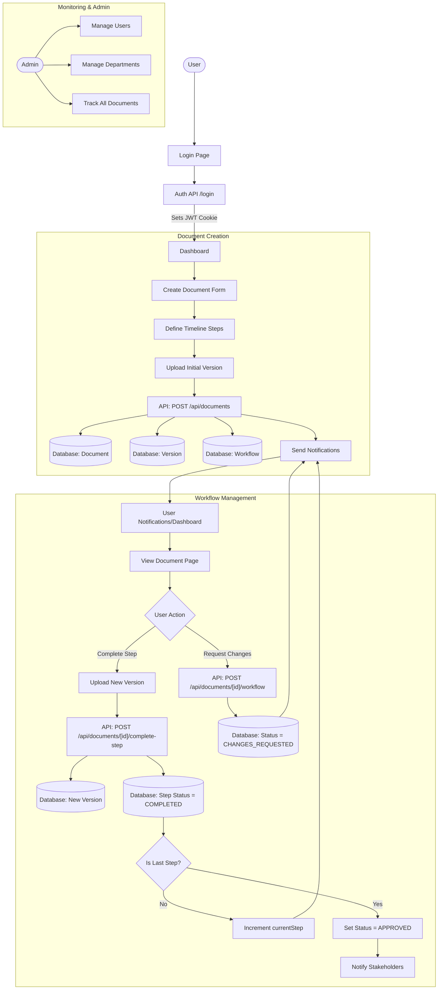

# E-Document System Flow Analysis

This document provides a comprehensive overview of the **E-Document** system flow, mapping out how users interact with the platform, how documents are managed, and how the approval workflow operates.

## System Flow Architecture

The following flowchart illustrates the high-level logic of the system, from authentication to the terminal approval of documents.

## Key Process Breakdown

### 1. Authentication
- **Mechanism**: JWT-based authentication using `bcrypt` for password hashing and `jsonwebtoken` for token generation.
- **Storage**: Tokens are stored in HTTP-only cookies for security.
- **Roles**: The system supports `ADMIN`, `EDITOR`, `APPROVER`, and `DRAFTER`.

### 2. Document Creation
- Users (typically `DRAFTER`) create documents by providing a title, type, and priority.
- A **Workflow Timeline** must be defined at creation, specifying the sequence of roles/departments required for approval.
- The first version of the document is uploaded and stored in `/public/uploads`.

### 3. Workflow Management
- **Step-by-Step Approval**: The document moves through a sequence of steps. Only users with the matching role and department for the current step can take action.
- **Version Control**: Every time a `DRAFTER` or `EDITOR` completes a step, they must upload a new version, ensuring a complete audit trail.
- **State Transitions**:
    - `DRAFT`: Initial state.
    - `FOR_REVIEW`: When it's in a review/approval step.
    - `CHANGES_REQUESTED`: When an approver requests revisions.
    - `APPROVED`: Terminal state when all steps are completed.

### 4. Notifications
- The system automatically generates notifications for:
    - New document creation (sent to relevant department members and admins).
    - Step completion.
    - Final approval.
    - Change requests.

### 5. Data Model
- **Core Entities**: `User`, `Department`, `Document`, `DocumentVersion`, `WorkflowInstance`, `WorkflowStep`, `Comment`, `Notification`.
- **Database**: SQLite (via Prisma) is used for development.

---
